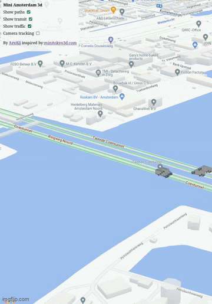

# Mini Amsterdam 3D Digital Twin

## Introduction
Welcome to the Mini Amsterdam 3D Digital Twin project! This is my individual coursework project for the 3D Modeling for City Digital Twins course at ITC, University of Twente. Inspired by [Mini Tokyo 3D](https://minitokyo3d.com/), I created a real-time 3D visualization system that shows live transit data in Amsterdam, alongside simulated company vehicles.

## Technical Stack
### Frontend
- **Google Maps JavaScript API** with Vector rendering mode
- **deck.gl** for WebGL-powered 3D visualization layers
- **ScenegraphLayer** for 3D vehicle models
- **PathLayer** for route visualization
- **Custom vehicle models** (in GLTF format) for different transport types

### Backend
- **Node.js** server with WebSocket support
- **ZeroMQ** for subscribing to NDOV (Dutch public transport) data feed
- **Fast-XML-Parser** for parsing GVB transit data
- **RD to WGS84** coordinate conversion for Dutch mapping system

### Real-time Data Integration
- Live GVB (Amsterdam Public Transport) data via NDOV Loket
- Custom WebSocket server for real-time updates
- Coordinate transformation from Dutch RD system to WGS84

## Preview



_(Example gif of the deck.gl overlay with real-time traffic and company vehicles.)_

## Setup Instructions
1. Clone the repository:
```bash
   git clone https://github.com/AzyAli/mini-amsterdam-3d.git
   cd mini-amsterdam-3d/APP/website/google-3d
```
2. Install dependencies:
```bash
npm install
```
3. Set up environment variables:
```bash
export GoogleMapsAPIKey=<your_google_maps_api_key>
export GoogleMapsMapId=<your_google_maps_map_id>
```

## Usage

1. Start the WebSocket server (handles NDOV data):
```bash
node server.js
```
2. In a new terminal, start the frontend:
```bash
npm start
```
3. Open your browser and navigate to http://localhost:3000 (or you can change it to any local port in both the app and server)

## Features

- Real-time visualization of GVB transit vehicles (buses, trams)
- Simulated company vehicles with 3D models
- Toggle layers (paths, transit, traffic)
- Interactive camera tracking
Tooltip information for transit vehicles

### Implementation Notes

- The server connects to NDOV Loket's ZMQ feed for real-time transit data
- Data is parsed from XML format and transformed to WGS84 coordinates
- WebSocket connection ensures real-time updates to the frontend
- Separate server architecture allows for better scaling and debugging


### Data Source & Acknowledgments

- NDOV Loket for real-time transit data 

- 3D model is based on "Low Poly Truck" (https://sketchfab.com/3d-models/low-poly-truck-98826ebd44e2492298ac925461509216) by Arifido._ (https://sketchfab.com/Arifido._) licensed under CC-BY-4.0 (http://creativecommons.org/licenses/by/4.0/).

- Course instructors at ITC for guidance and advice.

- To build your own application with deck.gl and Google Maps, check out the [documentation of @deck.gl/google-maps module](../../../docs/api-reference/google-maps/overview.md)
